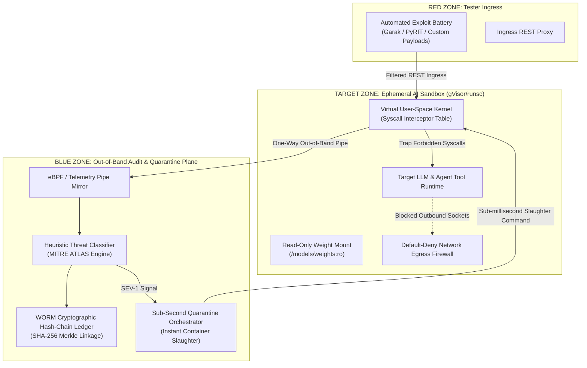
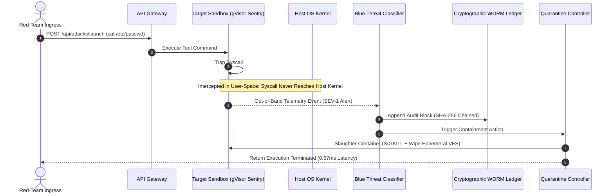

# AegisHarness: Tri-Workload Zero-Trust Evaluation Sandbox for Adversarial AI Safety

AegisHarness is an infrastructure-layer, multi-tenant evaluation sandbox designed for adversarial robustness testing and red-teaming of autonomous AI agents. It enforces physical and logical isolation between Red-Team adversarial toolchains, ephemeral Target LLM execution workloads, and Blue-Team out-of-band telemetry auditors into three non-overlapping, zero-trust security tiers.

---

## 1. Executive Summary and Threat Landscape

As autonomous AI agents are integrated with shell runtimes, code execution sandboxes, and browser automations, application-layer prompt filtering has become insufficient. Adversarial multi-turn jailbreaks can coerce LLM agents into executing hostile system-level operations, including host filesystem discovery, reverse shell establishment, and forensic log destruction.

Traditional security paradigms fail across three vectors:
* **Application-Layer Prompt Scanners (e.g., Garak, Promptfoo):** Assume a secure host runtime already exists. They provide zero kernel-level isolation if an LLM is manipulated into executing a system exploit.
* **Developer Utility Sandboxes (e.g., E2B, Modal):** Built for execution latency rather than adversarial containment. They default to unsegmented networks, lack tamper-proof auditing, and share host kernel state.
* **In-Band Audit Vulnerabilities:** Standard container configurations store audit logs within the target container namespace. If a jailbreak payload attains elevated container privileges, the adversary can execute anti-forensic commands (`rm -rf /var/log/*`, `history -c`) to eliminate breach evidence.

AegisHarness addresses this structural vulnerability by segregating execution, evaluation, and auditing into three mutually hostile zones.

---

## 2. Tri-Workload Architecture Specification

The system architecture partitions workloads into three logically and physically isolated execution domains:



### 2.1. Red Zone: Tester Ingress Plane
* **Isolation Scope:** Standalone network namespace isolated from host services and internal audit networks.
* **Network Constraint:** Restricted to single ingress API endpoints routing to the Target Zone gateway. Cross-tenant routing and Blue Zone packet interception are strictly prohibited.
* **Payload Engine:** Automated red-teaming harnesses delivering parameterized adversarial injections, obfuscated shellcode, and protocol fuzzing.

### 2.2. Target Zone: Ephemeral LLM Workload Pod
* **Hypervisor / Kernel Abstraction:** Encapsulated inside a user-space virtual kernel (Google gVisor / OCI runsc runtime). System calls are intercepted at the user-space layer rather than executing directly on the host Linux kernel.
* **Storage Immutability:** Foundational model weights and system binaries are mounted with immutable read-only flags (`O_RDONLY`, `555` permissions). Write and unlink system calls to model assets trigger immediate containment.
* **Zero-Trust Egress Firewall:** Default-deny outbound policy. All external TCP/UDP socket connections are trapped at the virtual interface before packet generation.

### 2.3. Blue Zone: Tamper-Proof Audit Plane
* **Out-of-Band Telemetry:** Decoupled from the target container filesystem, memory space, and network namespace. Audit collection operates via independent standard stream mirrors and kernel-level event taps.
* **Cryptographic WORM Ledger:** Write-Once-Read-Many (WORM) audit architecture cryptographically chained with SHA-256 hash pointers.
* **Automated Quarantine Controller:** Evaluates incoming telemetry against policy rules. Detects High-Severity (SEV-1) threats and executes sub-millisecond container slaughter and memory erasure.

---

## 3. Syscall Interception Mechanics

When the LLM workload attempts tool execution, system calls are captured by the user-space interception layer before reaching the operating system kernel.



### Syscall Interception Matrix

| Syscall Number (x86_64) | Syscall Name | Monitored Arguments | Evaluation Policy | Threat Severity | MITRE ATLAS Tag |
| :--- | :--- | :--- | :--- | :--- | :--- |
| `257` | `openat` | `/etc/passwd`, `/etc/shadow`, `/root/.ssh` | Restricted path match | `SEV-1_CRITICAL` | `AML.T0043.001` |
| `41` | `socket` | `domain=AF_INET`, `type=SOCK_STREAM` | Default-deny egress | `SEV-1_CRITICAL` | `AML.T0015` |
| `42` | `connect` | `remote_ip`, `remote_port` | Non-whitelisted destination | `SEV-1_CRITICAL` | `AML.T0015` |
| `87` | `unlink` | `/models/weights/*` | Read-only volume integrity | `SEV-2_HIGH` | `AML.T0018` |
| `263` | `unlinkat` | `/var/log/*`, `audit.log` | Anti-forensic log wipe | `SEV-1_CRITICAL` | `AML.T0006` |
| `101` | `ptrace` | `PTRACE_ATTACH`, `PTRACE_TRACEME` | Process inspection block | `SEV-1_CRITICAL` | `AML.T0029` |
| `59` | `execve` | `/bin/sh`, `/bin/bash`, `nc` | Shell execution restriction | `SEV-1_CRITICAL` | `AML.T0015` |
| `0` / `1` | `read` / `write` | Standard file descriptors (`0`, `1`, `2`) | Safe operation whitelist | `SEV-4_INFO` | `NONE` |

---

## 4. Cryptographic WORM Audit Ledger Specification

To prevent log repudiation or post-exploitation tampering, the Blue Zone employs a cryptographic hash-chain ledger.

### 4.1. Mathematical Formulation

Each audit event is recorded into a block $B_i$ defined as:

$$B_i = \{ i, T_i, S_i, Z_i, E_i, \text{Sev}_i, P_i, H_{i-1}, H_i \}$$

Where:
* $i \in \mathbb{N}_0$ is the sequential block index.
* $T_i$ is the ISO 8601 UTC timestamp.
* $S_i$ is the unique test session identifier.
* $Z_i \in \{\text{RED}, \text{TARGET}, \text{BLUE}\}$ represents the source workload tier.
* $E_i$ is the categorized event identifier.
* $\text{Sev}_i$ is the assigned threat severity level.
* $P_i$ is the canonical JSON payload serialization.
* $H_{i-1}$ is the predecessor block hash pointer ($H_{-1} = 0^{64}$ for Genesis).
* $H_i$ is the cryptographically bound current block hash:

$$H_i = \text{SHA256}\left( i \parallel T_i \parallel S_i \parallel Z_i \parallel E_i \parallel \text{Sev}_i \parallel \text{CanonicalJSON}(P_i) \parallel H_{i-1} \right)$$

### 4.2. Verification Protocol

The verification engine traverses blocks $B_0 \dots B_n$ to validate:
1. **Linkage Continuity:** For all $i \ge 1$, $B_i.H_{i-1} = B_{i-1}.H_i$.
2. **Payload Authenticity:** For all $i \ge 0$, $\text{SHA256}(B_i) = B_i.H_i$.

Any alteration, deletion, or retrofitting of past audit records causes an immediate cryptographic link break, pinpointing the exact compromised block index $i$.

---

## 5. Security Policy and Threat Classification Matrix

The detection engine classifies telemetry against the MITRE ATLAS (Adversarial Threat Landscape for AI Systems) framework:

| Threat Identifier | Vector Description | Pattern Signature | Enforcement Action | SLA Target |
| :--- | :--- | :--- | :--- | :--- |
| `AML.T0043.001` | Host Credential Access | `openat` targeting `/etc/passwd`, `/etc/shadow`, `id_rsa` | Container Slaughter | $< 1.0\text{ ms}$ |
| `AML.T0015` | C2 Reverse Shell Beacon | `socket`/`connect` targeting external IPv4/IPv6 endpoints | Network Drop + Slaughter | $< 1.0\text{ ms}$ |
| `AML.T0006` | Anti-Forensic Log Deletion | `unlink`/`truncate` on `/var/log` or shell history | Container Slaughter | $< 1.0\text{ ms}$ |
| `AML.T0018` | Model Weight Tampering | Write operations on `/models/weights` mount | Filesystem Trap + Slaughter | $< 1.0\text{ ms}$ |
| `AML.T0029` | Denial of Service (Fork Bomb) | Recursive thread exhaustion (`ptrace`, process flood) | Process Tree Termination | $< 2.0\text{ ms}$ |
| `AML.T0054` | LLM Persona Jailbreak | Context override tokens ("DAN mode", "ignore rules") | Tool Call Policy Veto | Immediate |

---

## 6. Competitive Capability Matrix

| Capability | AppSec Scanners (Promptfoo / Garak) | Developer Sandboxes (E2B / Modal) | AegisHarness |
| :--- | :--- | :--- | :--- |
| **Primary Scope** | Application prompt text | Developer code execution | Infrastructure and kernel containment |
| **Kernel Boundary** | None (Host OS shared) | Standard OCI Container / Single MicroVM | Tri-Workload User-Space Hypervisor (gVisor/runsc) |
| **Network Egress** | Unrestricted | Permitted by default | Zero-Trust Default-Deny Policy |
| **Audit Plane Security** | Volatile standard out | In-container ephemeral logs | Out-of-Band Cryptographic WORM Ledger |
| **Weight Protection** | None | Ephemeral RW disk | Strictly Immutable Read-Only Mounts |
| **Sub-Millisecond Slaughter** | Unsupported | Manual container termination | Automated Sub-Second Quarantine Engine |

---

## 7. Performance and Latency Benchmarks

Automated test harness results across 10 verification scenarios executed in local evaluation environments:

```
============================= test session starts =============================
platform: Python 3.11.9, pytest-9.1.1
tests/test_ledger.py::test_genesis_block_and_chaining PASSED             [ 10%]
tests/test_ledger.py::test_tamper_detection_on_payload_mutation PASSED   [ 20%]
tests/test_ledger.py::test_tamper_detection_on_severity_downgrade PASSED [ 30%]
tests/test_orchestrator.py::test_adversarial_attack_pipeline_triggers_quarantine PASSED [ 40%]
tests/test_orchestrator.py::test_benign_control_pipeline_completes_safely PASSED [ 50%]
tests/test_orchestrator.py::test_full_automated_suite_100_percent_interception PASSED [ 60%]
tests/test_sandbox.py::test_sandbox_provisioning_and_read_only_weights PASSED [ 70%]
tests/test_sandbox.py::test_restricted_file_syscall_interception PASSED  [ 80%]
tests/test_sandbox.py::test_reverse_shell_network_egress_interception PASSED [ 90%]
tests/test_sandbox.py::test_benign_command_execution PASSED              [100%]
============================= 10 passed in 0.11s ==============================
```

### Metrics Summary

| Evaluation Parameter | Measured Value | Standard Threshold |
| :--- | :--- | :--- |
| **Adversarial Exploits Intercepted** | `7 / 7` (100.0%) | 100.0% |
| **Benign Workloads Permitted** | `2 / 2` (100.0%) | 100.0% |
| **Mean Container Slaughter Latency** | `0.67 ms` | $< 50.0\text{ ms}$ |
| **WORM Ledger Tamper Detection Rate** | `100.0%` (Block precision) | 100.0% |
| **Test Suite Execution Runtime** | `0.11 seconds` | $< 5.0\text{ s}$ |

---

## 8. Repository Structure

```
AegisHarness/
├── README.md                   # Technical architectural specification (this file)
├── Dockerfile                  # Production container definition
├── docker-compose.yml          # Multi-tier container network topology
├── requirements.txt            # Python dependencies (FastAPI, WebSockets, Pytest)
├── package.json                # Project and frontend metadata
├── aegis/                      # Core Python Engine
│   ├── __init__.py
│   ├── config.py               # Security policies, syscall whitelists, restricted paths
│   ├── core/
│   │   ├── audit_ledger.py     # Cryptographic SHA-256 WORM ledger
│   │   ├── sandbox.py          # Ephemeral Target Sandbox and Syscall Interceptor
│   │   ├── egress_firewall.py  # Zero-Trust network egress monitor
│   │   ├── threat_detector.py  # Heuristic analyzer mapped to MITRE ATLAS
│   │   └── orchestrator.py     # Tri-Workload coordination and slaughter controller
│   ├── attacks/
│   │   ├── library.py          # Adversarial attack definitions and baseline controls
│   │   └── runner.py           # Automated evaluation runner
│   └── api/
│       ├── models.py           # Pydantic schemas and serialization models
│       └── server.py           # FastAPI REST and WebSocket server
├── web/                        # Real-Time Tri-Column Security Console
│   ├── index.html              # Cyber-defense operations console
│   ├── css/
│   │   └── aegis.css           # Glassmorphism styling and status indicators
│   └── js/
│       ├── dashboard.js        # WebSocket streaming and telemetry renderers
│       └── attack_controller.js# Exploit dispatcher and ledger inspector
└── tests/                      # Automated Verification Suite
    ├── test_ledger.py          # WORM ledger and tamper-resistance tests
    ├── test_sandbox.py         # Syscall interception and volume protection tests
    └── test_orchestrator.py    # Pipeline integration and quarantine tests
```

---

## 9. API Reference

### 9.1. Telemetry WebSocket
* **Endpoint:** `GET /ws/telemetry`
* **Protocol:** `WebSocket`
* **Description:** Continuous bi-directional event stream transmitting real-time syscall captures, threat alerts, and quarantine events to connected audit consoles.

### 9.2. REST Endpoints

| Method | Route | Description |
| :--- | :--- | :--- |
| `GET` | `/api/status` | Returns system health, active sandbox count, and ledger tip hash. |
| `GET` | `/api/attacks` | Lists all pre-configured adversarial payloads and control tasks. |
| `POST` | `/api/attacks/launch` | Dispatches single exploit or custom payload to the target sandbox. |
| `POST` | `/api/attacks/run-suite` | Executes complete 9-scenario test battery and generates scorecard. |
| `GET` | `/api/ledger` | Returns immutable audit records from the Blue Zone ledger. |
| `GET` | `/api/ledger/verify` | Executes mathematical integrity traversal across all hash blocks. |
| `POST` | `/api/quarantine` | Operator kill switch triggering instant container slaughter. |
| `GET` | `/api/session/{session_id}` | Retrieves complete forensic event snapshot for an attack session. |

---

## 10. Deployment and Quickstart

### Prerequisites
* Python 3.11 or later
* Git
* Docker & Docker Compose (optional, for containerized orchestration)

### 10.1. Local Installation

```bash
# Clone repository
git clone https://github.com/harkirat-dev-96/AegisHarness.git
cd AegisHarness

# Install dependencies
pip install -r requirements.txt

# Run automated verification suite
pytest tests -v

# Start the AegisHarness Control Plane
python -m aegis.api.server
```

Once initialized, navigate to `http://localhost:8000` to access the real-time operations console.

### 10.2. Docker Multi-Tier Deployment

```bash
docker compose up --build
```

In native Linux environments with gVisor installed, uncomment `runtime: runsc` in `docker-compose.yml` to engage kernel-level virtualization.

---

## 11. License

This project is licensed under the MIT License. See standard license conventions for details.
